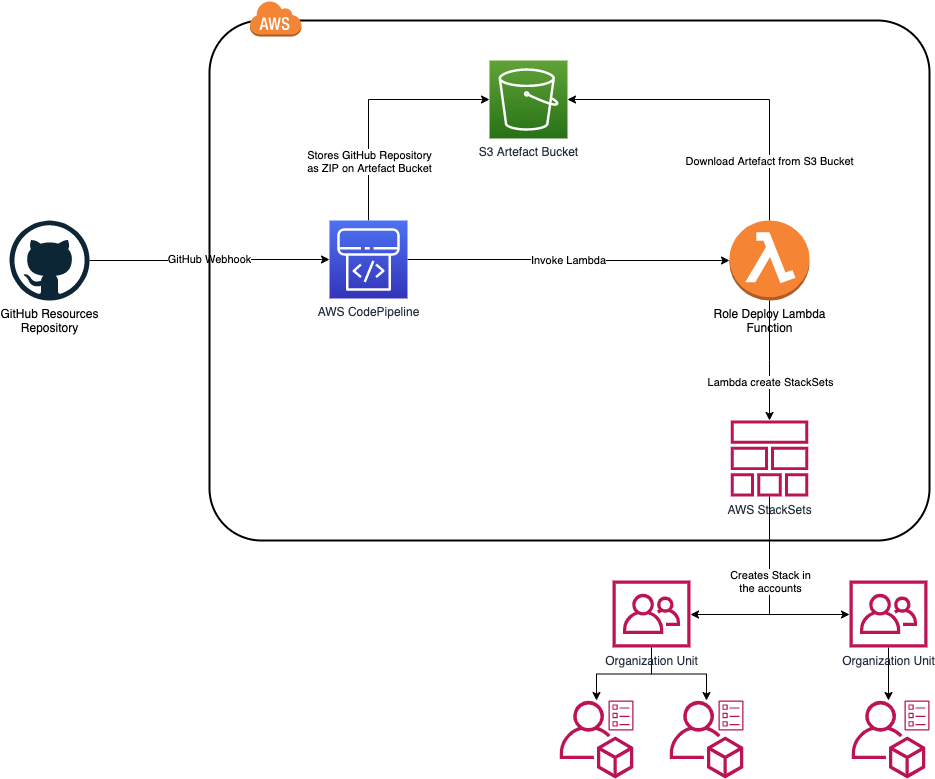

# StakckSets CI/CD Pipeline in Organizations

## What problem does this artefact solve

Customers who cannot use an AWS SSO, but have several accounts under one AWS Organization, build their own solutions by choosing one account as central login account, which contains the corresponding IAM users or IAM Federation with an Active Directory.
This account is then used to connect to other accounts via an assume role. For this to be possible, roles must be present in the accounts and must also be kept synchronous (via Organization Units).
However, most companies fail because although CloudFormation or Terraform is ideally used to create the roles, they are manually deployed to the accounts, especially if they have hundreds of accounts, mostly running out of sync by deployment of new and changed role over their Organization after some months. 
This is where the CI/CD pipeline comes in, which allows the OU structure to be easily mapped in the code revision tool of choice and CloudFormation roles and policies to be stored there, which are automatically changed in the accounts when changes are made.

## What are the assumptions / prerequisites to run deployment

You should have at minimum two new accounts, one for getting the management account and at least one for the guest account.
To test the CI/CD Pipeline you need a GitHub Account to store the Roles/Policies and create a Token that Codepipeline GitHub Connector could access your GitHub, which is described in the manual. To use the CI/CD Pipeline with other Sources (like S3, Codecommit etc.) the source connector at Codepipeline has to be changed.

## What Resources will be created

* S3 Bucket and Policy
* Codepipeline
* Lambda Function
* Role and Policies for Codepipeline and Lambda execution
* Stacks
* Stacksets

## What is the high level workflow of the resources of the artefact

## What implicit / explicit parameter settings do I have to consider before stack deploy

The Stack could deployed by changing the parameters, there is no need to change the code of the Stack. If you don't want to use GitHub as Source there are several other providers like S3 for CodePipeline, which has to be changed in the CloudFormation Template.

## What is not supported yet / Ideas for improvement

* Create a SNS and use it for sending a notification after successfully deployed changes or when failing
* Create a Tutorial how to setup an own account as IAM User account (with or without AD Federation)
* Change the Lambda that corresponding Roles are created in the user account that allow assume role to the roles of accounts inside an OU
* Create a event watcher which starts the CodePipeline when the first account is moved to an OU
* Create a Tutorial how to integrate an acknowledge function inside CodePipeline to deploy changes first after user with permission acknowledge the changes happened

## Caveats

* Exception handling inside the Lambda could be getting extended as you don't get information about failure / successfully exection of the Pipeline

## Open Known Issues

* Exception will be thrown when there are resource to be created for an OU which doesn't have an account. Handling should be done on OU Level, so the deployment of the other OUs should not be harmed.

## How do I deploy the stack
  
Follow the instructions at

* [01 - Create Organization](docs/01%20Create%20Organization/README.md)
* [02 - Invite Accounts](docs/02%20Invite%20Accounts/README.md)
* [03 - Organization Accounts](docs/03%20Organize%20Accounts/README.md)
* [04 - Deploy Lambda](docs/04%20Deploy%20Lambda/README.md)
* [05 - Deploy CI/CD Pipeline](docs/05%20Deploy%20CI-CD%20Pipeline/README.md)
* [06 - Demo Time](docs/06%20Demo%20Time/README.md)
