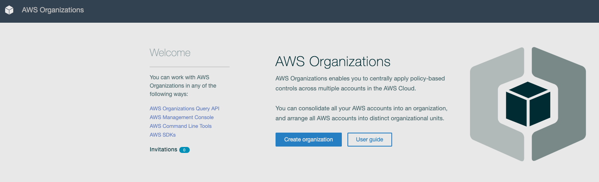
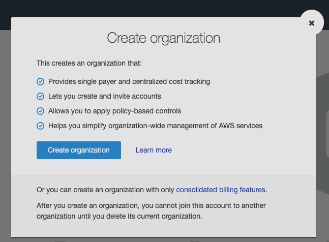
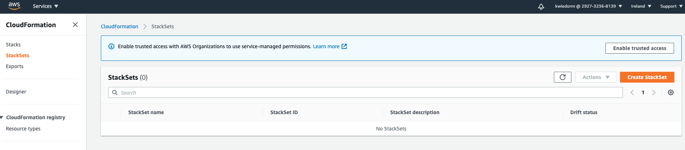
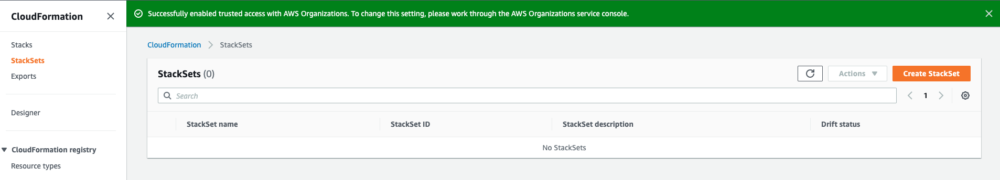

# 01 - Create Organization

Before we start to deploy the Code we have to setup AWS Organizations in our Management Account.

Access your management account AWS Console and navigate to **AWS Organizations**

To create a Organization you simply have to click the **Creat organization** button.

After you clicked on the button a dialog will open where you have to click **Create organization** again.

After this you should have a AWS Organization with All Feature enabled. Before we can go to the next step and invite accounts into the new created organization we have to enable [trusted access](https://docs.aws.amazon.com/AWSCloudFormation/latest/UserGuide/stacksets-orgs-enable-trusted-access.html) for AWS StackSets. This is required to setup **service managed** StackSets.

## Enable trusted access with AWS Organizations

Navigate to **AWS CloudFormation** and click on the left site on **StackSets**

You should see a button with **Enable trusted access** at the top inside the blue area described with **Enable trusted access with AWS Organizations to use service-managed permissions.**

Click on **Enable trusted access**. After some time you shoud see a message which tells you that you successfully enabled trusted access with AWS Organizations.

