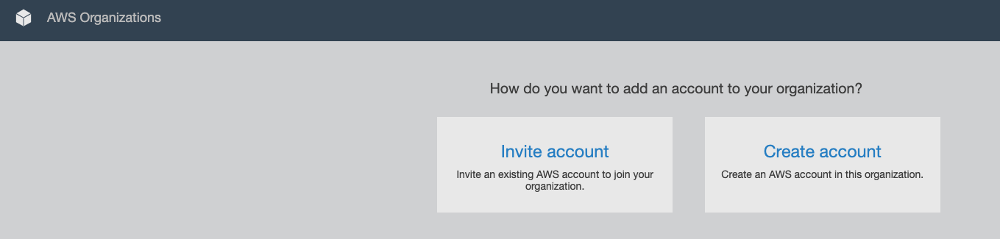
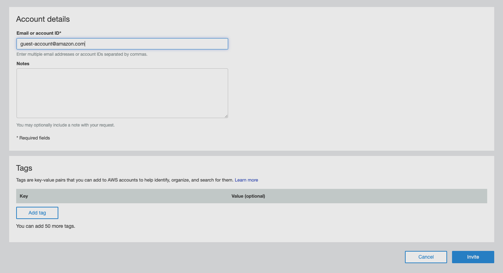
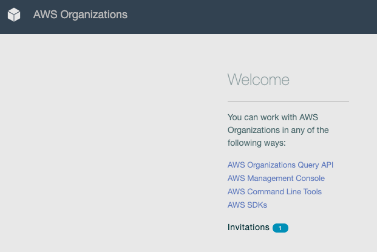
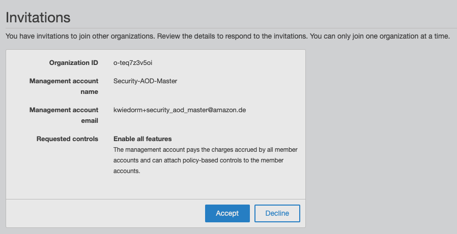
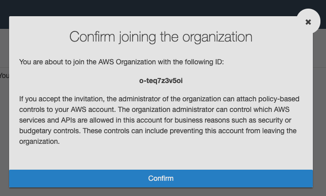
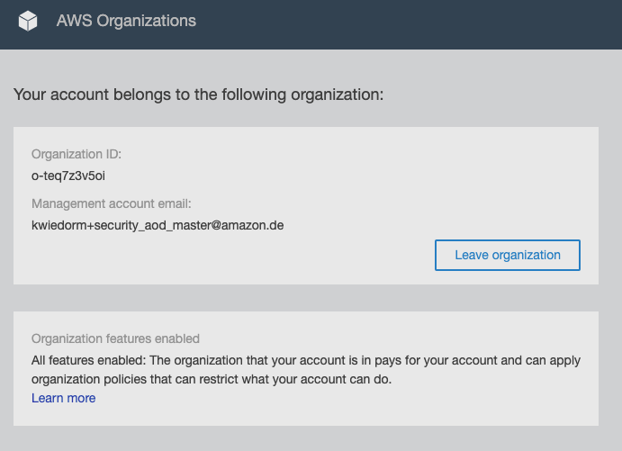

# 02 - Invite Accounts

After we created the AWS Organization and enabled trusted access for AWS CloudFormation StackSets it's time to invite at minimum one account.

Access your management account AWS Console and navigate to **AWS Organizations**

Click on **Add account** which should lead you to the account invitation page

Navigate to **Invite account**

In the Field **Email or account ID** enter the account ID of the account you want to invite (or the Email), you can add a Note and Tags which is optional.

Click on **Invite** to send the invitation to the account.

When you got access to the Email of the invited account you should receive an Email that you got invited to join an AWS Organization. The account won't added into the organization until the account owner confirm to join the organization.

## Confirm to join the organization

Login to the account you invited before and navigate to **AWS Organizations**

You should see a **1** of one behind the link **Invitations**, which means the account has an open invitation to join an AWS Organization.

Click on the **Invitations** link.

You should now see a page where you get information about the organization you got invited to join. Click on **Accept** to join the organization, which opens a dialog where you have to click **Confirm**

After that you should see the information that the account belongs now to an organization and where you could leave the organization.

