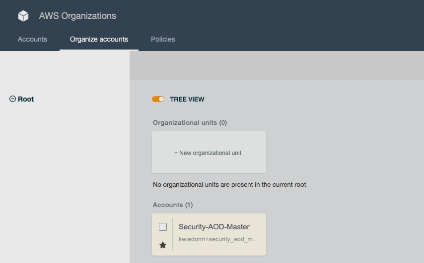
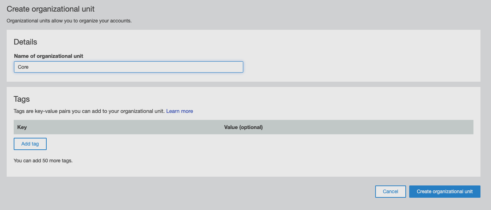
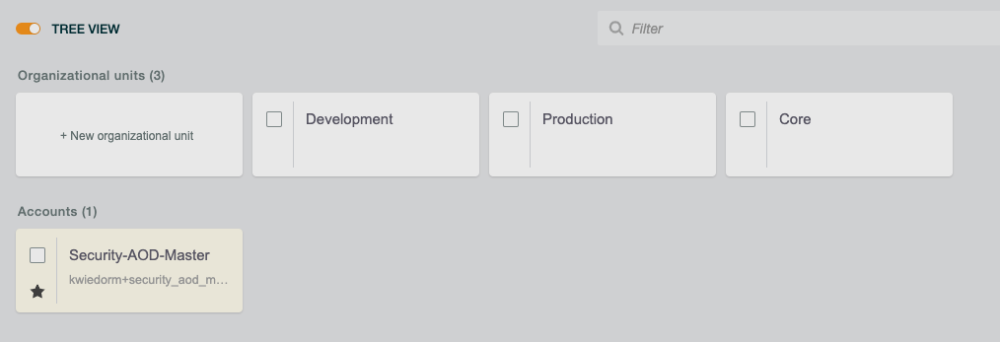
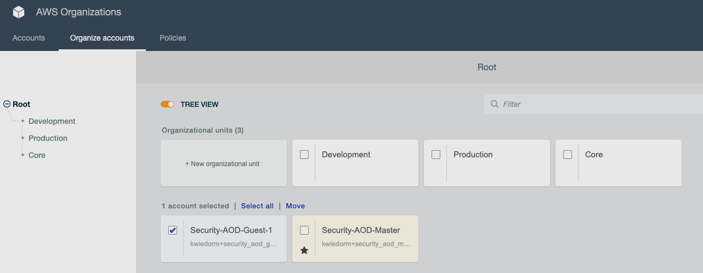
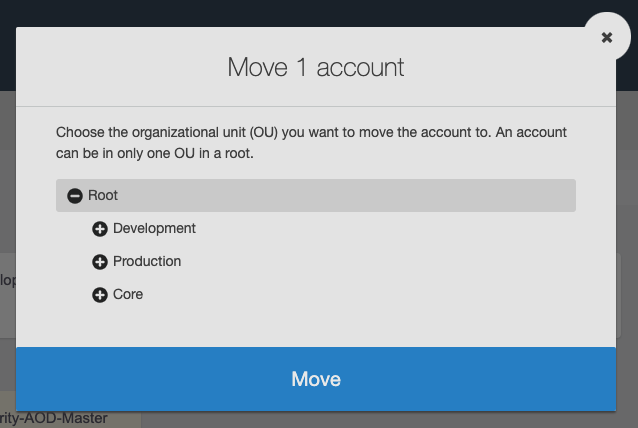
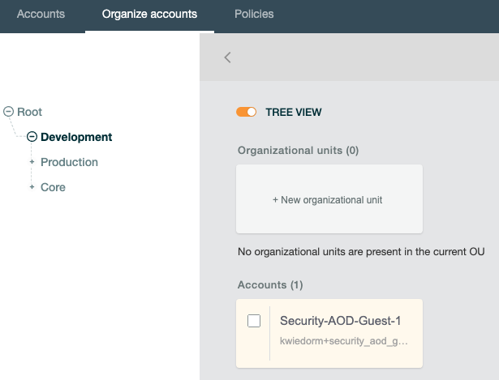

# 03 - Organize Accounts

After we invited our guest accounts it is time to create the **Organization Units** and move the accounts into them.

To learn more about AWS Organizations terminology and concepts visit this [site](https://docs.aws.amazon.com/organizations/latest/userguide/orgs_getting-started_concepts.html) 

## Create Organization Units

Navigate to **AWS Organizations** and at the page select the tab **Organize accounts**

In the new organization we should see only **Root** on the left site of the screen, which means we  don't have any organizational unit (OU) created before.

Click on **New organizational unit** to create a new one

In the following formular you are able to name the OU you want to create (for the Demo create **Core**, **Production** and **Development**)

Submit the formular with **Create organizational unit**

When you created the three OU you should get following screen

## Move accounts into an organizational unit

When you created the OU the accounts are still in the Root OU. To assign them to the corresponding OU we have to move them.

Click on the account you want to move. After that you will see a **Move** link above the account and that the checkbox is checked.

A dialog opens where you can select the OU you want to move the account to. Click for example on **Production**.

.

We should have at minimum one account inside the **Production** OU. When you got two seperate accounts beside the master account, repeat the procedure and move the second account into the **Development** OU.

To verify that the accounts are inside the OU, you can click on the OU (or at the name of the OU at the tree on the left).

.