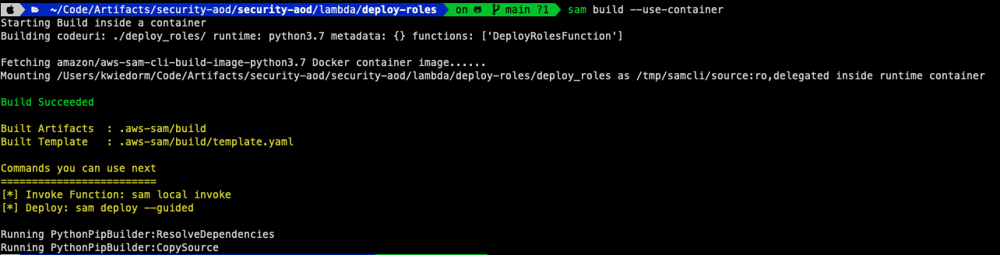
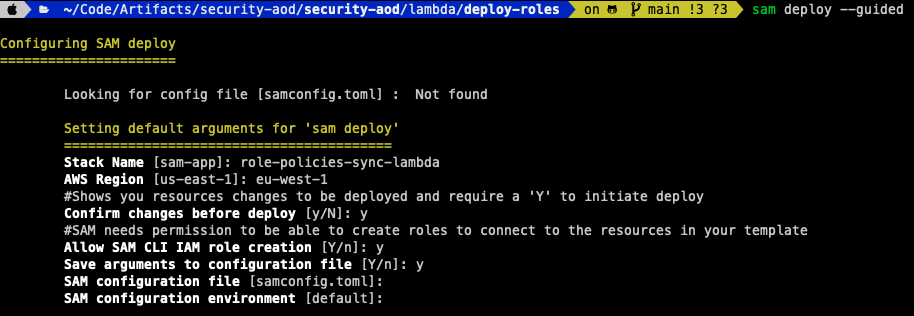
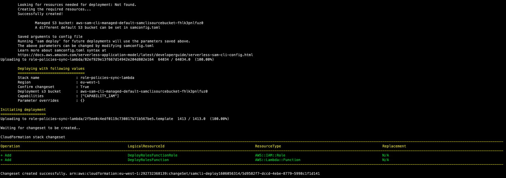
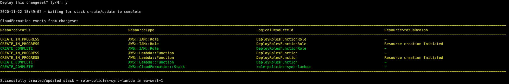

# 04 - Deploy Lambda

The Deploy Lambda is responsible to create a consolidated CloudFormation Template from the single files inside each directory and create or update the StackSets.

It should be deployed to the management account where you created your organization.

## Deploy the application

The Serverless Application Model Command Line Interface (SAM CLI) is an extension of the AWS CLI that adds functionality for building and testing Lambda applications. It uses Docker to run your functions in an Amazon Linux environment that matches Lambda. It can also emulate your application's build environment and API.

To use the SAM CLI, you need the following tools.

* SAM CLI - [Install the SAM CLI](https://docs.aws.amazon.com/serverless-application-model/latest/developerguide/serverless-sam-cli-install.html)
* [Python 3 installed](https://www.python.org/downloads/)
* Docker - [Install Docker community edition](https://hub.docker.com/search/?type=edition&offering=community)

To build and deploy your application for the first time, run the following in your shell from the **lambda/deploy-roles** where you unpacked the artefact:

```bash
sam build --use-container
sam deploy --guided
```

The first command will build the source of your application and add all required dependencies to the package.



The second command will package and deploy your application to AWS, with a series of prompts:

* **Stack Name**: *role-policies-sync-lambda*
* **AWS Region**: The AWS region you want to deploy your app to.
* **Confirm changes before deploy**: If set to yes, any change sets will be shown to you before execution for manual review. If set to no, the AWS SAM CLI will automatically deploy application changes.
* **Allow SAM CLI IAM role creation**: Many AWS SAM templates, including this example, create AWS IAM roles required for the AWS Lambda function(s) included to access AWS services. By default, these are scoped down to minimum required permissions.
* **Save arguments to samconfig.toml**: If set to yes, your choices will be saved to a configuration file inside the project, so that in the future you can just re-run `sam deploy` without parameters to deploy changes to your application.



After you configured the deployment the required resources will be created on the account and you will get shown the changeset before it gets deployed, which you have to confirm with yes (only when you configured that option with yes)



After you confirmed with yes, the lambda and the required execution role gets deployed into your account.



To check that the stack got deployed successfully, you could run the AWS CLI command list-stacks or log into the management account and go to **AWS CloudFormation** > **Stacks** and search inside the list for the name of the stack you created.

```bash
aws cloudformation list-stacks
```

Beside that you could check that the lambda function got deployed by

```bash
aws lambda list-functions
```

And finaly by checking for the execution role

```bash
aws iam list-roles
```

## Cleanup

To delete the sample application that you created, use the AWS CLI. Assuming you used your project name for the stack name, you can run the following:

```bash
aws cloudformation delete-stack --stack-name deploy-roles
```

## Resources

See the [AWS SAM developer guide](https://docs.aws.amazon.com/serverless-application-model/latest/developerguide/what-is-sam.html) for an introduction to SAM specification, the SAM CLI, and serverless application concepts.

Next, you can use AWS Serverless Application Repository to deploy ready to use Apps that go beyond hello world samples and learn how authors developed their applications: [AWS Serverless Application Repository main page](https://aws.amazon.com/serverless/serverlessrepo/)
