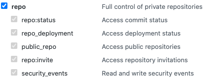
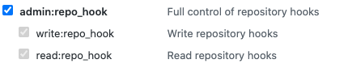
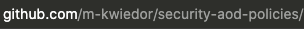

# 05 - Deploy CI/CD Pipeline

The Deploy CI/CD Pipeline is responsible to create a CI/CD Pipeline which got triggered when changes are made inside your Resources Code Repository.

## Prerequisite

1. Make sure you have a GitHub account
2. Create a Repository inside that account for the role resources (for example **security-aod-policies**)
3. Create a OAuth Token for the Codepipeline
   1. Go to the **Settings** in your GitHub account by click on your icon on the upper right site
   2. Go to the **Developer seetings** on the left site
   3. Go to the **Personal access tokens**
   4. Click on **Generate new token**
      1. Name the Token (for example **CodePipeline Token**)
      2. Select the required **scopes**
         1. Check the option **repo**
            
         2. Check the option **workflow**
            
         3. Check the option **admin:repo_hook**
            
      3. Click on **Generate token**
      4. Copy the generated token as we require them later when we deploy the CI/CD Pipeline through the CloudFormation Template

## Deploy the application

The deployment of the CI/CD Pipeline will be made through a CloudFormation Template. To deploy the CI/CD Pipeline, you need the following tools.

* AWS CLI - [Install the AWS CLI](https://docs.aws.amazon.com/cli/latest/userguide/install-cliv2.html)

You could deploy the CloudFormation Template through the AWS Console or trough the AWS CLI (from the *security-aod* code folder)

```bash
aws cloudformation create-stack \
  --stack-name role-policy-cicd-pipeline \
  --template-body file://cicd-pipeline/cicd-pipeline.yaml\
  --capabilities CAPABILITY_NAMED_IAM \
  --parameters \
      ParameterKey=GitHubBranch,ParameterValue=<GitHub Branch>,UsePreviousValue=false,ResolvedValue=string \
      ParameterKey=GitHubOAuthToken,ParameterValue=<GitHub OAuth Token>,UsePreviousValue=false,ResolvedValue=string \
      ParameterKey=GitHubRepo,ParameterValue=<GitHub Repository Name>,UsePreviousValue=false,ResolvedValue=string \
      ParameterKey=GitHubUserName,ParameterValue=<GitHub Account Name>,UsePreviousValue=false,ResolvedValue=string
```

* **GitHubBranch**: The branch at GitHub for the source (default: **main**).
* **GitHubOAuthToken**: The GitHub OAuth Token you created under **Prerequisite**.
* **GitHubRepo**: The GitHub Repository Name you created under **Prerequisite**.
* **GitHubUserName**: The GitHub account name.

GitHubRepo and GitHubUserName could be found in the URL when you navigate to your repository



GitHibUserName is the first part of the URL behind **github.com**: m-kwiedor
HitHubRepName is the second part of the URL behind your user name: security-aod-policies

## Resources deployed

This CloudFormation will deploy following resources

Logical ID | Type | Description
--- | --- | ---
ArtifactBucket | AWS::S3::Bucket | This Bucket stores the artefacts created by the CloudFormation Template, by CodePipeline and the created CloudFormation Templates of the role-deploy Lambda.
GitHubOAuthTokenSecret | AWS::SecretsManager::Secret | The secret to store the GitHub OAuth Token
CodePipelineRole | AWS::IAM::Role | Role for CodePipeline to store artefacts from GitHub to S3 and invoke Lambda function
CodePipelineLambda | AWS::CodePipeline::Pipeline | The CI/CD CodePipeline
CodePipelineWebhook | AWS::CodePipeline::Webhook | GitHub Webhook triggered on changes

## Cleanup

To delete the sample application that you created, use the AWS CLI.

Before you execute the command, make sure the S3 Bucket which gots created is empty, you have to delete each folder/file by your own.

Assuming you used your project name for the stack name, you can run the following:

```bash
aws cloudformation delete-stack --stack-name role-policy-cicd-pipeline
```

## Resources

See the [AWS SAM developer guide](https://docs.aws.amazon.com/serverless-application-model/latest/developerguide/what-is-sam.html) for an introduction to SAM specification, the SAM CLI, and serverless application concepts.

Next, you can use AWS Serverless Application Repository to deploy ready to use Apps that go beyond hello world samples and learn how authors developed their applications: [AWS Serverless Application Repository main page](https://aws.amazon.com/serverless/serverlessrepo/)
