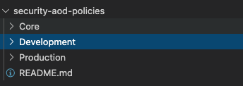
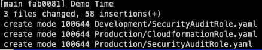
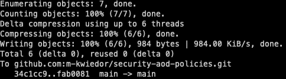
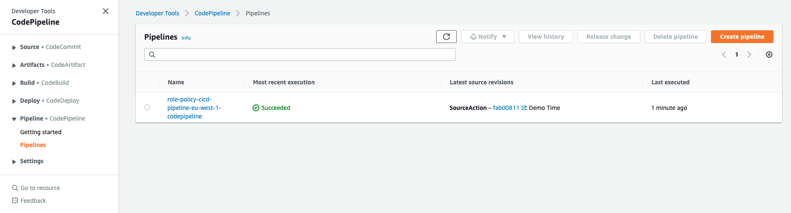
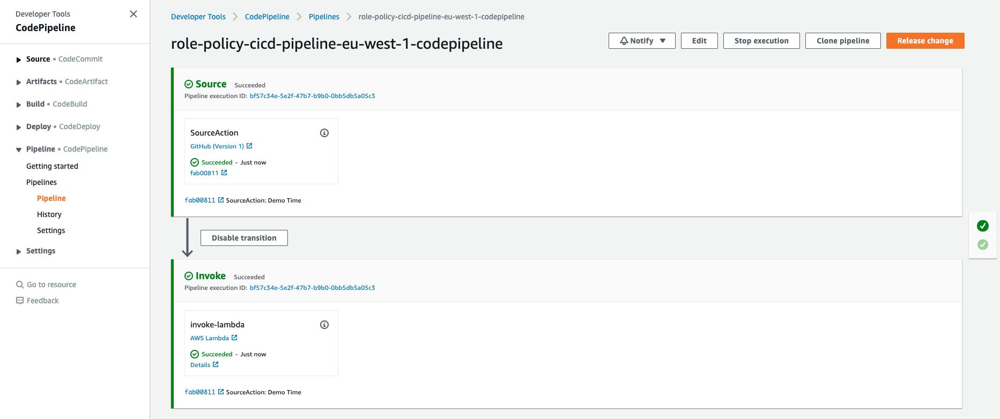
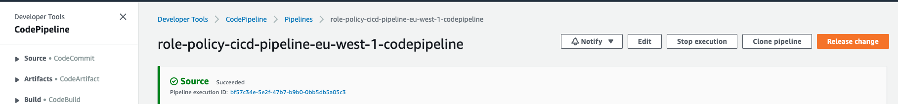
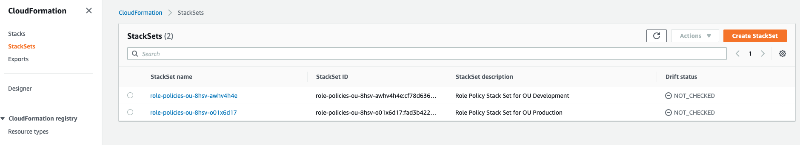
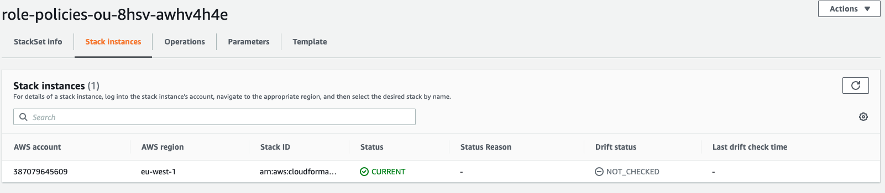
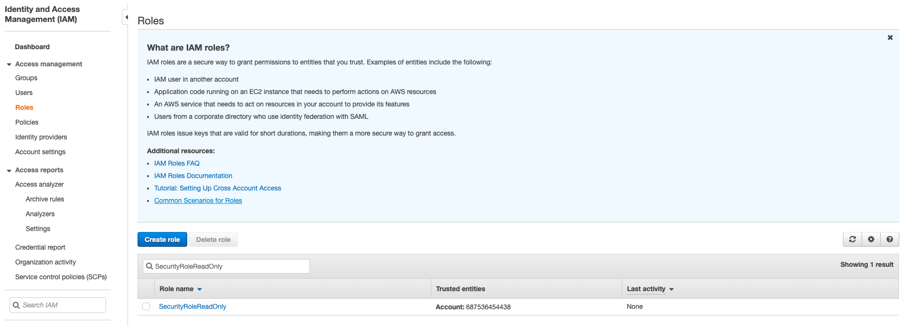
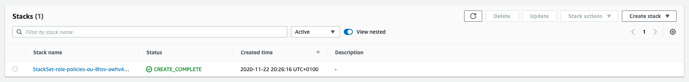

# 06 - Demo Time

Now we want that we created Roles inside the account(s) which belongs to the **Production** organizational unit.

## Prerequisite

1. Make sure you have a GitHub account 
2. Create a Repository inside that account for the role resources (for example **security-aod-policies**)
3. [Git CLI installed](https://git-scm.com/book/en/v2/Getting-Started-Installing-Git)

We should got 1 and 2 from 05 - Deploy CI/CD Pipeline Prerequisites.

## Clone the Role Resources Repository

Open a Terminal and go to the directory where you want to create your Role Resources Repository and clone the existing GitHub Repository. The required URI you should find inside the Repository by clicking on **Code** and selecting **HTTPS** or **SSH**

```bash
git clone git@github.com:m-kwiedor/security-aod-policies.git
```

This will create a directory inside the folder you executed the git clone command (in this case **security-aod-policies**).

## Create the folder structure

Open the folder with your prefered tool (for example Visual Studio Code) and create folders based on the OU structure you created. In our Demo we create **Core**, **Production** and **Development**



### Create our first resources

Create a file called **SecurityAuditRole.yaml** inside **Production** and copy & past following code

```yaml
Resources:
  SecurityRoleReadOnly:
    Type: AWS::IAM::Role
    Properties:
      RoleName: SecurityRoleReadOnly
      MaxSessionDuration: 3600
      Path: /
      AssumeRolePolicyDocument:
        Version: 2012-10-17
        Statement:
          - Effect: Allow
            Principal:
              AWS: arn:aws:iam::687536454438:root
            Action: sts:AssumeRole
      ManagedPolicyArns:
        - arn:aws:iam::aws:policy/SecurityAudit
```

When you got the second account and moved that into the **Development** OU, create the same file in the **Development** folder. Important when you write roles and/or policies, start with **Resources:**

Now let us create a second role in the **Production** environment. This time create a file **CloudformationRole.yaml** only in the **Production** folder and copy & past following code

```yaml
Resources:
  CloudformationRole:
    Type: AWS::IAM::Role
    Properties:
      AssumeRolePolicyDocument:
        Version: "2012-10-17"
        Statement:
          - Effect: Allow
            Principal:
              Service:
                - ec2.amazonaws.com
            Action:
              - sts:AssumeRole
      Path: "/"
  CloadformationPolicies:
    Type: AWS::IAM::Policy
    Properties:
      PolicyName: root
      PolicyDocument:
        Version: "2012-10-17"
        Statement:
          - Effect: Allow
            Action: "cloudformation:*"
            Resource: "*"
      Roles:
        - !Ref CloudformationRole
```

In this code we are using a reference from the Policy to the Role as you can see at the **!Ref CloudformationRole** inside the **CloadformationPolicies**

In this case we don't care about whats the purpose of the Roles or Policies, we just want to demostrate the deployment of the resources inside the organizational unit accounts.

## Get ready for Action Time

To start the magic inside AWS we have to push our changes to our Git Repository. 

1. Make sure you are in the folder where you cloned the Git Repository
2. Add the new files and folders to your local store
```bash
git add .
```
3. Commit your local store
```bash
git commit -m "Demo Time"
```


4. Push your local store to Git
```bash
git push
```


## Action Time

Navigate at your management account to **CodePipeline**

You should now see the previous created CodePipeline with a Last executed time near the time you pushed the code into GitHub



By click on the name of the CodePipeline you get into the detailed view of our CI/CD Pipeline.



Both of our actions **Source** and **Invoke** should be **succeeded**

When you get a failed on one, there are some topics you can check to find a possible error.

### Source failed

* Check your GitHub OAuth token and [update the Stack](https://docs.aws.amazon.com/AWSCloudFormation/latest/UserGuide/updating.stacks.walkthrough.html) with the token, if this won't work create a new token (remove the existing WebHook and OAuth Token at GitHub).
* Check that the parameters of GitHub Account Name and Repository Name fit your GitHub environment.

### Lambda failed

* Navigate to **AWS Lambda**, select the **role-policies-sync-lambda** function and inside **Monitoring** click on **View logs in CloudWatch**.
  * Check the logs for exceptions of the Python script.
* Execution failed displayed at the CodePipeline could lead to a wrong policy for the CodePipeline execution role.

### Restart the CodePipeline without changes

Navigate to the CodePipeline we created and press the **Release Change** button on the top.



## Verify the magic

Navigate inside your management account to **AWS CloudFormation** and there to **StackSets**. For each OU we got recources in our Git Repository we will see one StackSet (**Note: There must be at minimum one account in the OU to get the StackSet deployed**)

The name convention for creating the StackSets from the lambda is **role-policies-{OU-ID}**



Now select on of the stackset which got deployed and navigate to **Stack Instances**



The accounts which moved under the OU should be listed in this list with the **Status** of *CURRENT*, when the **Status** shows **OUTDATED** it means that the changes didn't got deployed right now to the account. Depending on the number of accounts it could take some time.

Lets verify that the roles are deployed to the account by login into the Guest account and navigate to **IAM** and there to **Roles**. Search for *SecurityRoleReadOnly* which should be displayed in the list.



You can confirm that the resources got deployed into the account also by navigating to **AWS CloudFormation**  where you should see the corresponding Stack.



# Congratulations! You did the Demo!

Try now to add a sub OU under Production and move the account from Production OU into the new OU! Try to deploy the role into that new OU.

